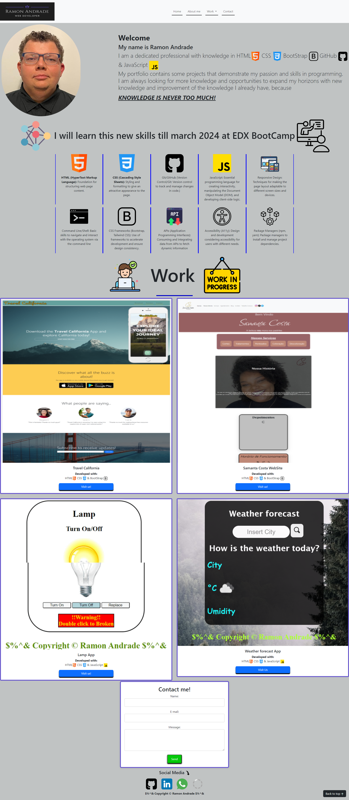
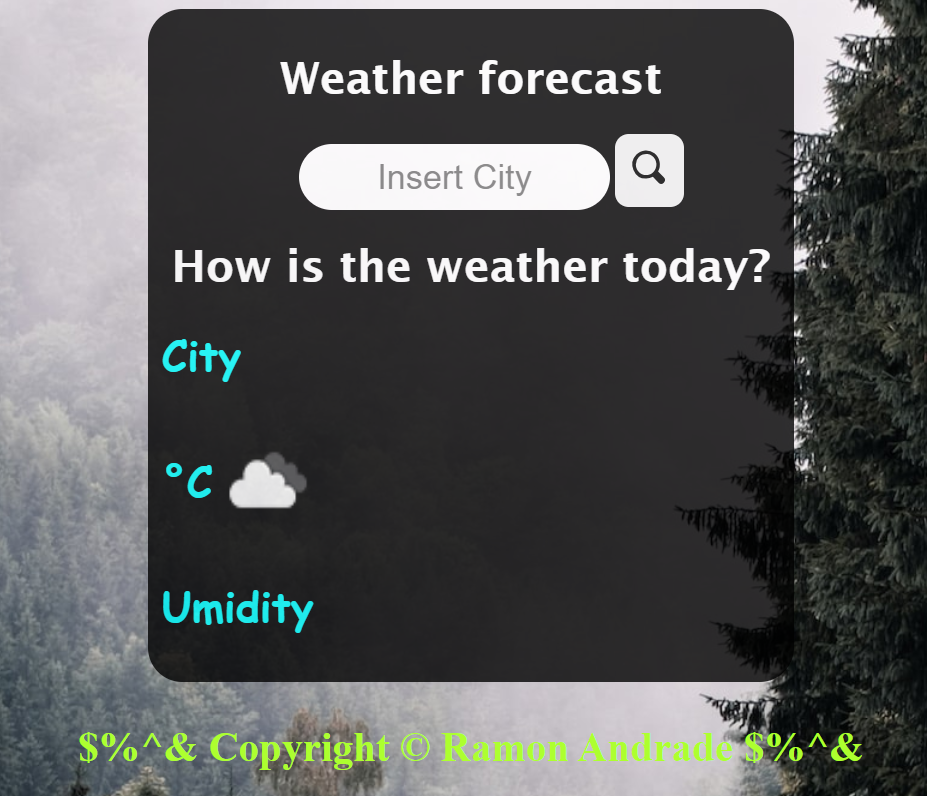

# Ramon's Portfolio (Bootstrap version)

This is the repository that contains the source code and files related to my personal portfolio. This portfolio highlights some of the projects and work I have been working on.

## Content

- [About Me](#about-me)
- [Projects](#projects)
- [Technologies](#technologies)
- [Contact](#contact)

## About me

I am `Ramon Andrade`, a developer passionate about creating innovative solutions and solving challenging problems. My experience includes: `HTML`, `CSS`, `BootStrap` & `JavaScript`.

## Projects

### Portfolio
 Live https://ramon-portfolio.vercel.app/
- Screen above 1050px

- Screen below 1049px

#### NavBar 
- Contains logo and button that directs to the exact location of the page

#### Welcome
- Contains a brief text describing a little about me

#### Work 
- Contains some of my projects carried out during my apprenticeship

#### New Skills 
- Contains all especteds new skills e will learn during my BootCamp

#### Contact 
- Contains ways to contact me:  
  - Form
  - WhatsApp
  - Social medias

### Project in the portfolio

Here are some of the projects highlighted in my portfolio:

1. Travel California 
    - WebSite (Fake company)
    - Technologies used: HTML, CSS and Bootstrap.
    - Live: https://ramonsaguini.github.io/travel-california/ 
    - Repository: https://github.com/ramonsaguini/travel-california 
    
    
    
2. Samanta Costa Website
    - Hair Dresser website..
    - Technologies used: HTML and BootStrap
    - Live: https://site-88uh6wqe1-ramonsaguini.vercel.app/ 
    - Repository: https://github.com/ramonsaguini/siteSam 

    

3. Lamp App
    - App made to turn on/off, break and fix a light bulb. (JavaScript training)
    - Technologies used: HTML, CSS and JavaScript
    - Live: https://ramonsaguini.github.io/turnOnTurnOffLamp/ 
    - Repository: https://github.com/ramonsaguini/turnOnTurnOffLamp

    

4. Weather Forecast 
    - Current weather checking app. Shows current temperature, relative humidity and whether the sky is clear, cloudy, etc...
    - Technologies used: HTML, CSS, JavaScript and using the api resource.
    - Live: https://weather-pkoejl4ub-ramonsaguini.vercel.app/ 
    - Repository: https://github.com/ramonsaguini/weather 
    
    

## Technologies

Some of the technologies I'm comfortable with include:

- HTML 
- CSS 
- JavaScript(in advance of learning) 
- BootStrap(in advance of learning) 

## Contact

  - Email: ramon_saguini1@hotmail.com
  - Linkedin  https://www.linkedin.com/in/ramon-saguini-de-andrade-a40728277/
  - GitHub  https://github.com/ramonsaguini
  - WhatsApp <a href="https://wa.me/4407723028494" target="_blank">
               +44 7723 028494</a>

Feel free to explore my projects and get in touch if you have any questions or collaboration opportunities.